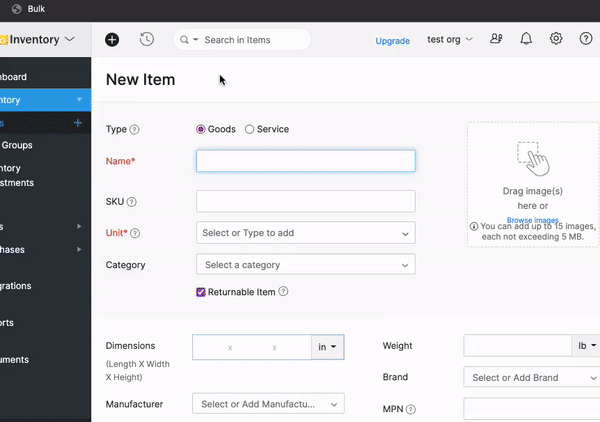

= Bulk create Zoho Inventory categories

When running a `.csv` items import in Zoho Inventory, the categories are not created automatically. Instead, only existing categories are assigned to the items.

The below bookmarklet allows you to bulk create the categories in Zoho Inventory.

[source,js]
----
javascript:(function(){
    const script = document.createElement('script');
    script.setAttribute('src', 'https://cdn.jsdelivr.net/gh/devidw/zoho-inventory-bulk-create-categories/index.js');
    document.body.appendChild(script);
}())
----

. Add the bookmarklet to your browser's bookmarks bar.
. Edit an item in Zoho Inventory and open the _Manage Categories_ Dialog (make sure you have at least one category).
. Execute the bookmarklet.
+
Once you execute the bookmarklet, you will be prompted to enter the categories you want to create. You can enter multiple categories separated by a comma. White spaces are trimmed before the categories are created.

NOTE:: If you are migrating categories from one Zoho Inventory organization to another, you can simply copy all the category names from the tree vie in your one organization by selecting them all. Now you have a newline separated list in your clipboard, when you have copied your selection. Simply replace the new lines with commas using an online text processor of your choice, and paste the comma separated list into the bookmarklet prompt.